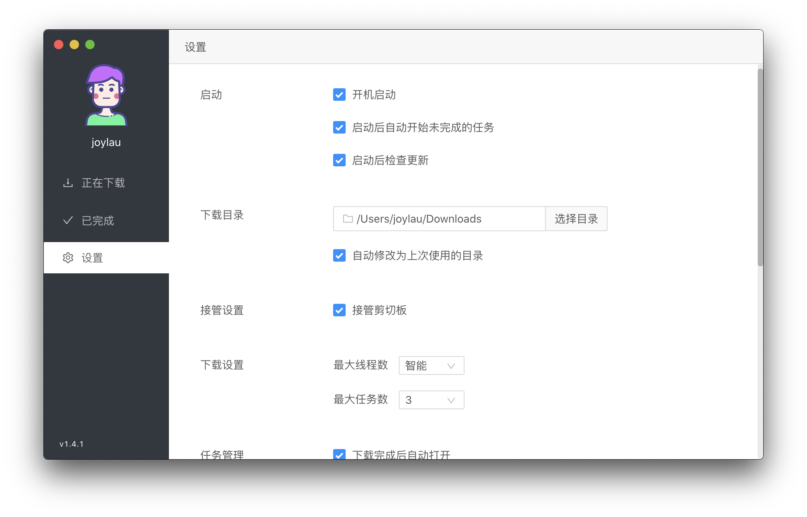
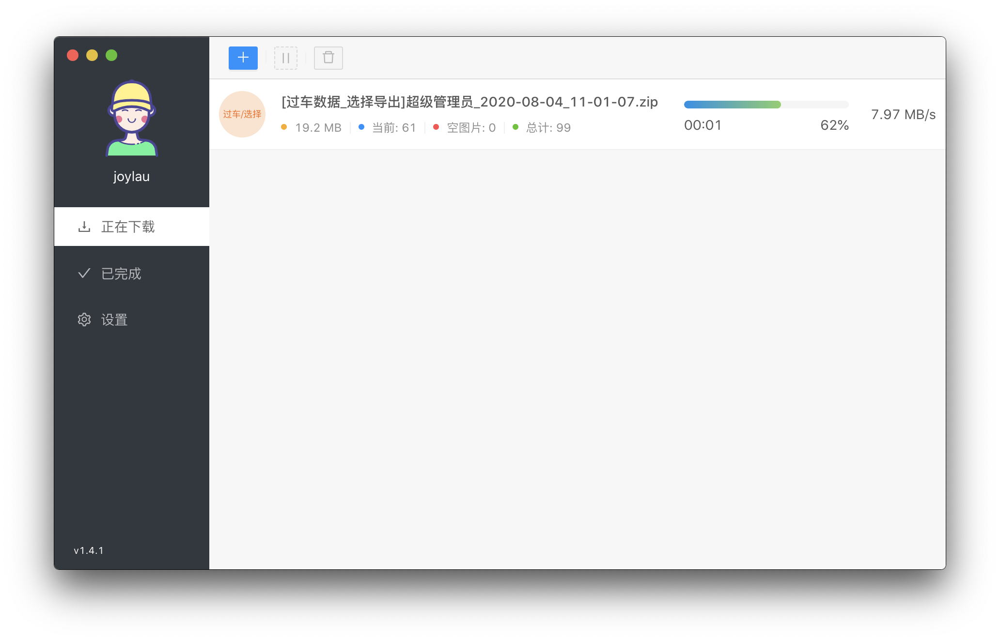
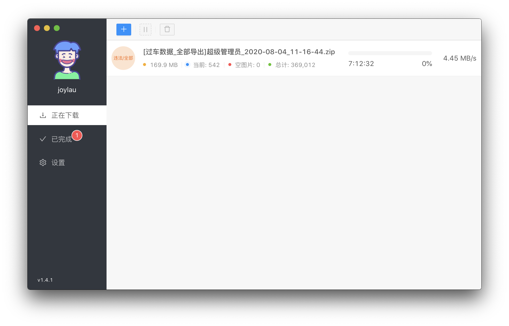
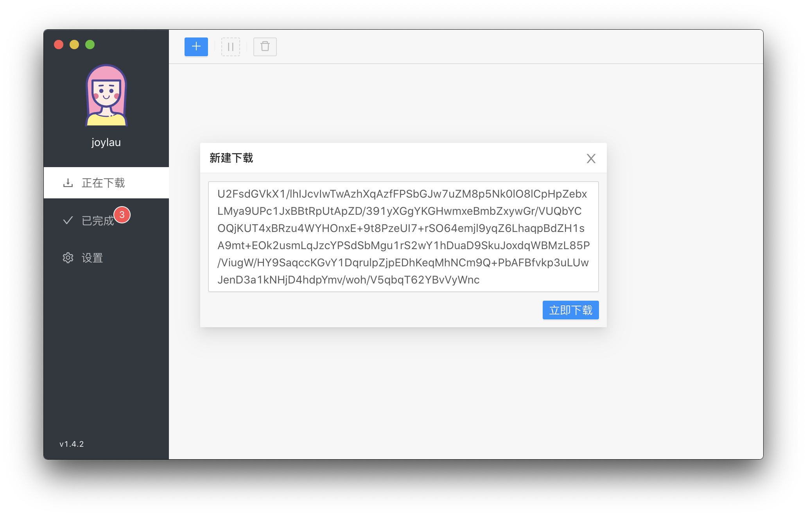
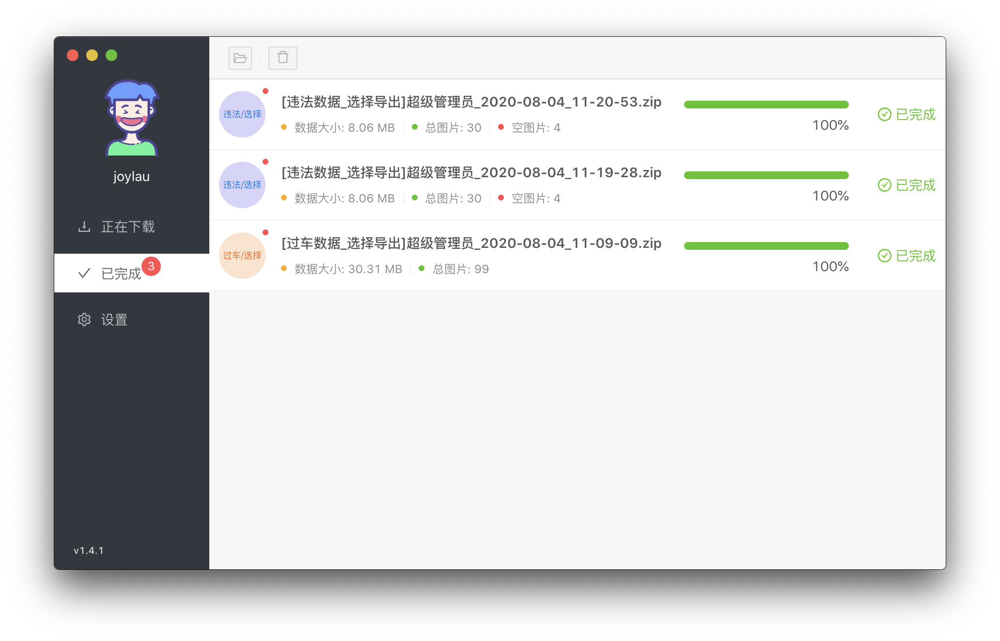

## ITMS Download Manager

> 作者: 刘法 <liuf@ahtsoft.com>

### 预览

### 功能
- 用于导出过车图片数据和违法图片数据

### 特点
- 客户端连接服务端进行实时文件导出,省去了服务端计算文件再打包文件到资源服务器上的资源消耗,占用很少的服务端资源
- 软件被调起即执行导出操作, 省去了大量的等待服务端操作的时间
- 导出进度实时查看,出错的文件自动重试下载
- 可配置最大任务数,多管齐下,节约时间

### 更新记录
#### v1.4.2 [2020-08-04]
1. 修复删除任务的 BUG
2. 修复设置开机启动失败的问题
3. 新增多款头像, 可点击切换
4. 优化支持千万级别的过车数据导出
5. 新增软件启动时自动检测更新
6. 新增更新记录的展示
7. 修复在托盘状态下通过桌面快捷方式打开软件时弹出提示信息的问题

#### v1.4.1 [2020-07-23]
1. 图片下载速度优化
2. 新增显示空图片数目
3. 更新部分组件样式

#### v1.4.0 [2020-07-22]
1. 新增多任务下载
2. 新增断点续传功能

#### v1.3.4 [2020-07-13]
1. 新增根据口令手动添加下载任务
2. 更新设置界面布局
3. 新增设置: `开机启动`, `启动后自动开始未完成的任务`,`自动修改为上次使用的目录`,`接管剪切板`,`下载完成后自动打开`,`自动删除 "文件不存在" 的任务`,`下载失败时弹窗提示`,`显示悬浮窗`,`压缩类型设置`
4. 重新设计 MacOS 下的托盘图标

#### v1.3.1 [2020-07-08]
1. 修复 Windows 环境下客户端软件自动更新导致进程正在占用的问题

#### v1.3.0 [2020-07-07]
1. 新增客户端软件自动检测更新功能
2. 新增 Windows 下后台托盘功能, 客户端软件关闭后会继续下载任务
3. 修复客户端软件未启动时, 通过自定义协议调起无法执行下载任务的问题
4. 修复删除正在运行的任务时,导致下一次下载任务数据错乱的问题
5. 修复删除文件和删除任务逻辑混乱的问题
6. 更新下载文件保存本地时的命名规则

#### v1.2.0 [2020-07-05]
1. 新增下载任务暂停,继续,停止的功能

#### v1.1.0 [2020-06-19]
1. 代码结构优化
2. 新增本地数据库存储功能

#### v1.0.0 [????-??-??]
更新记录消失在神秘的二次元中....